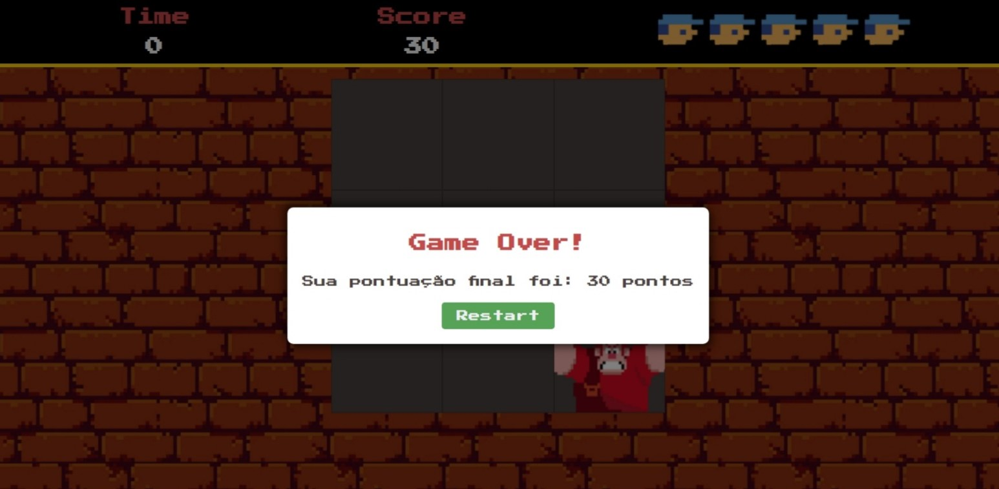

# Detona Ralph

Este é um jogo simples chamado "Detona Ralph" desenvolvido em JavaScript. O objetivo do jogo é clicar no quadrado correto para ganhar pontos enquanto o tempo está contando. Se o tempo acabar ou se perder todas as vidas, o jogo termina.

## Como Jogar

- Clique no quadrado correto para ganhar pontos.
- Cada clique bem-sucedido aumenta a pontuação em 10 pontos.
- Cada clique incorreto resulta na perda de uma vida.
- O jogo termina quando o tempo acaba ou todas as vidas são perdidas.

## Recursos e Funcionalidades

- **Painel de Pontuação:** Exibe a pontuação atual do jogador.
- **Tempo Restante:** Mostra o tempo restante no jogo.
- **Vidas:** Representadas por ícones do jogador; o jogo termina quando todas as vidas são perdidas.
- **Game Over Modal:** Aparece quando o jogo termina, mostrando a pontuação final.
- **Efeitos Sonoros:** Efeitos sonoros são reproduzidos para eventos como acertos e erros.

## Estrutura do Código

O código é estruturado em três principais seções:

1. **`state` Object:** Armazena o estado do jogo, incluindo elementos DOM, valores de jogo e ações (como temporizadores).
2. **Funções Principais:**
   - `countDown`: Atualiza o tempo restante e verifica se o jogo deve terminar.
   - `resetGame`: Reinicia as configurações do jogo.
   - `gameOver`: Encerra o jogo, exibindo o modal de fim de jogo.
   - `playSound`: Reproduz efeitos sonoros com base no nome do arquivo.
   - `randomSquare`: Seleciona aleatoriamente um quadrado como inimigo.
   - `addListenerHitBox`: Adiciona ouvintes de eventos aos quadrados do jogo.
   - `createLive`: Cria a representação visual de uma vida.
   - `setupLives`: Configura o número inicial de vidas.
   - `initialize`: Inicializa o jogo, configurando vidas e ouvindo eventos.
   - `hanleRestart`: Manipula a reinicialização do jogo após o término.

Divirta-se jogando o "Detona Ralph Game"! 🎮
